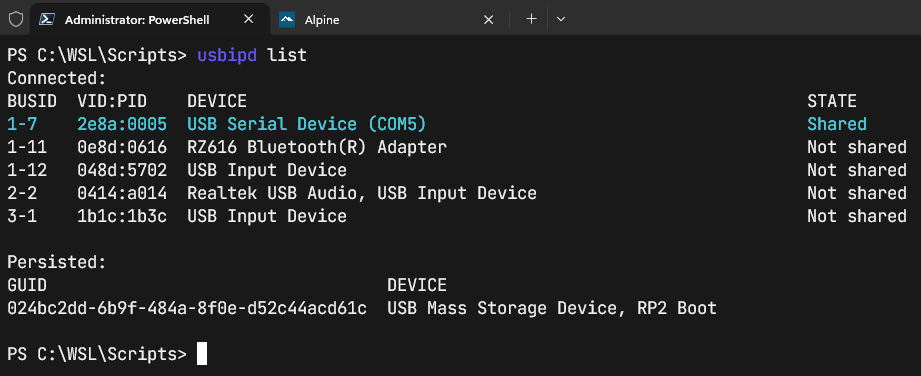
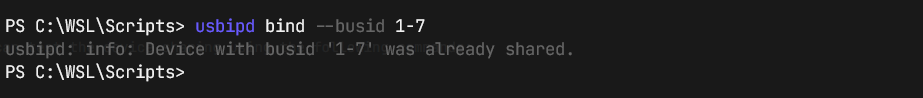
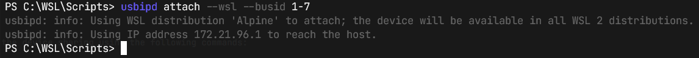
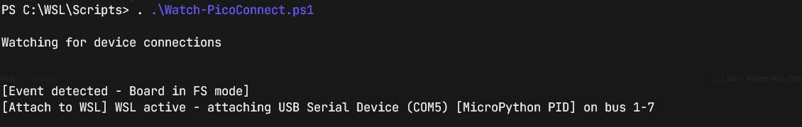
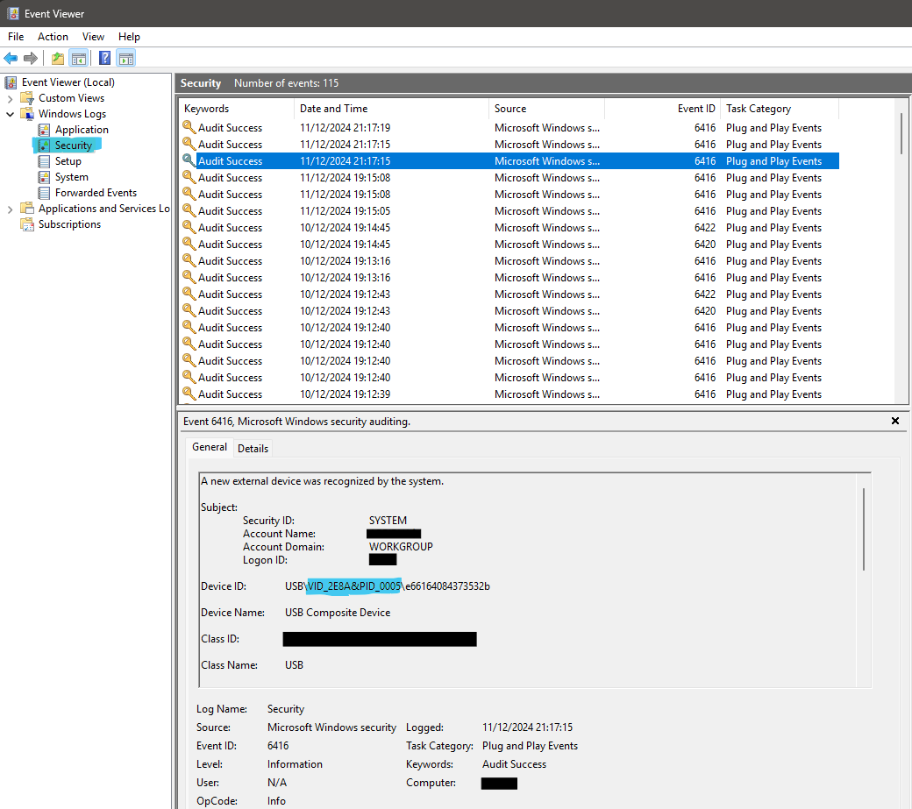

# Void WSL Dev

This repository contains instructions and scripts used to install and setup a Void Linux minimal root filesystem on WSL2.

[Void Linux](https://voidlinux.org/) is a general purpose operating system, based on the monolithic Linux kernel. Its package system allows you to quickly install, update and remove software; software is provided in binary packages or can be built directly from sources with the help of the XBPS source packages collection.

## Introduction

This setup is used mainly for Python development on WSL, but is also used for front-end projects and embedded projects using MicroPython and C on Raspberry Pi devices, which must be attached to WSL using [usbipd-win](https://github.com/dorssel/usbipd-win).

Void uses the `runit` supervision suite to run system services and daemons.

I prefer to use [Windows Terminal](https://apps.microsoft.com/detail/9n0dx20hk701?hl=en-US&gl=US) to manage my profiles for PowerShell and WSL distributions.

<!-- [!TIP] [!IMPORTANT] [!WARNING] [!CAUTION] -->

## 1. Download & install Void Linux

The minimal root filesystem can be downloaded from [Void Linux Downloads](https://voidlinux.org/download/). I create a WSL directory and a subdirectory for each distribution (e.g. `C:\WSL\Void`), where I keep my distribution images and where I have WSL create the vhdx image files. I download the [rootfs tarball](https://repo-default.voidlinux.org/live/current/void-x86_64-ROOTFS-20240314.tar.xz) from the Void downloads page.

On an administrator PowerShell, Void can be installed using the following commands:

```ps1
wsl --import Void C:\WSL\Void C:\WSL\Void\void-x86_64-ROOTFS-20240314.tar.xz
```

Check installation by listing distributions with verbose output:

```ps1
wsl -l -v
```

## 2. Setup Void Linux

I use a profile within Windows Terminal (Microsoft Store), which is set to run Void with the following command `C:\windows\system32\wsl.exe -d Void`.

### New user setup

New user setup - replace `$USERNAME` with your username:

```bash
useradd -m -G wheel -s /bin/bash $USERNAME
passwd $USERNAME
```

Make `$USERNAME` default user:

```sh
printf "[user]\ndefault=$USERNAME" > /etc/wsl.conf
```

Grant `sudo` to `$USERNAME`:

```sh
sed -i 's/# %wheel ALL=(ALL:ALL) ALL/%wheel ALL=(ALL:ALL) ALL/' /etc/sudoers
```

Microcontrollers attached to WSL are often placed in the dialout group by udev rules (/dev/ttyACM[0-9]). We will also create a custom rule
to enforce this in a later step. The command below adds the user to the 'dialout' group to facilitate connecting to these devices (if needed):

```sh
usermod -a -G dialout $USERNAME
```

### Update package manager & packages

XBPS is the native system package manager, written from scratch with a 2-clause BSD license. XBPS allows you to quickly install/update/remove software in your system and features detection of incompatible shared libraries and dependencies while updating or removing packages (among others).

```sh
xbps-install -Su xbps
xbps-install -Su
```

### Exit and restart void

```sh
exit
```

Check Void status in Powershell terminal:

```sh
wsl --list --running
```

It can take up to 7-8 seconds to terminate. If still active, run:


```sh
wsl --terminate Void
```

### WSL configuration

I configure WSL with the following config file at `/etc/wsl.conf`. I set the default WSL username under the `[user]`
settings and facilitate runit starting with WSL, by using the command `command = "/etc/runit/1 && /etc/runit/2 && /etc/runit/3"`
under `[boot]`. The `appendWindowsPath = true` setting under `[interop]`, allows the addition of Windows tools to be added to the
WSL distro `$PATH` automatically. The command `code .` would for example, be available in WSL and launch VSCode in the current working
WSL directory.

```sh
vi /etc/wsl.conf
```

Add the following to the config file:

```sh
# /etc/wsl.conf

[automount]
enabled = true
mountFsTab = true

[network]
generateHosts = true
generateResolvConf = true

[interop]
enabled = true
appendWindowsPath = true

[boot]
command = "/etc/runit/1 && /etc/runit/2 && /etc/runit/3"
```

The `[boot]` section will allow runit to start correctly.

## Generate SSH key & add to SSH agent

You can generate a new SSH key on your local machine. After you generate the key, you can add the public key to your account on GitHub.com to enable authentication for Git operations over SSH

```sh
ssh-keygen -t ed25519 -C "your_email@example.com"
```

When you're prompted to "Enter a file in which to save the key", you can press Enter to accept the default file location. At the prompt, type a secure passphrase.

I use the following command line setting in Windows Terminal for the Void Linux profile - `C:\WINDOWS\system32\wsl.exe -d Void -e /bin/bash -li` along with the following `.bash_profile` config:

```bash
# .bash_profile

# Define cleanup function for SSH agent
# stops WSL 2 from failing to terminate
# due to SSH agent still running
function cleanup_ssh_agent() {
    # Check if ssh-agent is running before attempting to kill it
    if [ -n "$SSH_AGENT_PID" ]; then
        ssh-agent -k > /dev/null 2>&1
        unset SSH_AGENT_PID
        unset SSH_AUTH_SOCK
    fi
}

# Register the cleanup function to execute when the shell exits
trap cleanup_ssh_agent EXIT

# Your existing SSH agent initialization code
# check if an SSH agent is running
ssh-add -l &>/dev/null
# exit code 2 means no agent is running at all
if [ "$?" == 2 ]; then
    # Could not open a connection to your authentication agent.

    # Load stored agent connection info.
    test -r ~/.ssh-agent && \
        eval "$(<~/.ssh-agent)" >/dev/null

    ssh-add -l &>/dev/null
    if [ "$?" == 2 ]; then
        # Start agent and store agent connection info.
        (umask 066; ssh-agent > ~/.ssh-agent)
        eval "$(<~/.ssh-agent)" >/dev/null
    fi
fi

# Load identities
ssh-add -l &>/dev/null
if [ "$?" == 1 ]; then
    # The agent has no identities.
    # Time to add one.
    ssh-add -t 4h
fi

# Get the aliases and functions
[ -f $HOME/.bashrc ] && . $HOME/.bashrc

. "$HOME/.local/bin/env"
```

This command and profile combination starts the SSH agent if not already and loads the SSH keys from `~/.ssh`, asking for the password you set. The SSH key is added to the agent with a 4 hour time window (`ssh-add -t 4h`) and the `cleanup_ssh_agent` function kills the agent if
you type exit or close the Void Linux terminal window. This stops a running agent from preventing WSL2 automatic shutdown.

## 3. Setup USB Device Sharing to WSL2 (Microcontrollers)

I use usbipd-win to share locally connected USB devices to other machines, including Hyper-V guests and WSL 2.
By default devices are not shared with USBIP clients. To lookup and share devices, run the following commands with
administrator privileges:

Install usbipd-win with winget:

```ps1
winget install usbipd
```

List devices with busid & state information using `usbipd list` command:

```ps1
usbipd list
```

The below image shows a connected Raspberry Pi Pico W device (highlighted in blue), with MicroPython installed. Raspberry Pi Vendor ID (VID) is '0x2e8a' and the
Product ID (PID) for MicroPython is '0x0005'. The device has been 'Shared' using the command `usbipd bind --busid 1-7`. All devices must be shared before they can be attached.



To share your device run the following command with the relevant busid value seen in the `usbipd list` output:

```ps1
usbipd bind --busid 1-7
```



As long as WSL is running, you can then attach the device to WSL using the following command:

```ps1
usbipd attach --wsl --busid 1-7
```



### Udev setup

Udev is a Linux subsystem for managing device events, which is used by Void Linux. By default, the rules for udev will be in `/usr/lib/udev/rules.d/`. A useful guide for writing udev rules is at [opensource.com](https://opensource.com/article/18/11/udev). If you list the directory contents, you will see the following rules:

```sh
$ ls -a /usr/lib/udev/rules.d/
/usr/lib/udev/rules.d/50-udev-default.rules
/usr/lib/udev/rules.d/60-autosuspend.rules
/usr/lib/udev/rules.d/60-block.rules
/usr/lib/udev/rules.d/60-cdrom_id.rules
/usr/lib/udev/rules.d/60-drm.rules
/usr/lib/udev/rules.d/60-evdev.rules
/usr/lib/udev/rules.d/60-fido-id.rules
/usr/lib/udev/rules.d/60-input-id.rules
/usr/lib/udev/rules.d/60-persistent-alsa.rules
/usr/lib/udev/rules.d/60-persistent-input.rules
/usr/lib/udev/rules.d/60-persistent-storage-tape.rules
/usr/lib/udev/rules.d/60-persistent-storage.rules
/usr/lib/udev/rules.d/60-persistent-v4l.rules
/usr/lib/udev/rules.d/60-serial.rules
/usr/lib/udev/rules.d/64-btrfs-dm.rules
/usr/lib/udev/rules.d/64-btrfs-zoned.rules
/usr/lib/udev/rules.d/64-btrfs.rules
/usr/lib/udev/rules.d/66-kvm.rules
/usr/lib/udev/rules.d/70-camera.rules
/usr/lib/udev/rules.d/70-joystick.rules
/usr/lib/udev/rules.d/70-memory.rules
/usr/lib/udev/rules.d/70-mouse.rules
/usr/lib/udev/rules.d/70-touchpad.rules
/usr/lib/udev/rules.d/75-net-description.rules
/usr/lib/udev/rules.d/75-probe_mtd.rules
/usr/lib/udev/rules.d/78-sound-card.rules
/usr/lib/udev/rules.d/80-drivers.rules
/usr/lib/udev/rules.d/80-net-name-slot.rules
/usr/lib/udev/rules.d/81-net-dhcp.rules
/usr/lib/udev/rules.d/90-usbmon.rules
```

We are going to create a new folder at `/etc/udev/rules.d/` and create a `60-micropython-rpi.rules` in order to demonstrate udev rule creation for Raspberry Pi devices running MicroPython. This should keep our custom rules separate from the default system rules. Hopefully they should take
precedence over system-provided rules and persist across system upgrades.

```sh
sudo mkdir /etc/udev/rules.d/
sudo vi /etc/udev/rules.d/60-micropython-rpi.rules
```

Inside the `60-micropython-rpi.rules` file, write the following:

```sh
# VID: 0x2E8A
# PID: 0x0005

SUBSYSTEM=="tty", \
ATTRS{idVendor}=="2e8a", \
ATTRS{idProduct}=="0005", \
MODE="0666", \
GROUP="dialout", \
SYMLINK+="/dev/ttyACM%n"

# Alternative rule
SUBSYSTEM=="tty", \
ATTRS{idVendor}=="2e8a", \
ATTRS{product}=="MicroPython*", \
MODE="0666", \
GROUP="dialout", \
SYMLINK+="/dev/ttyACM%n"
```

> [!TIP]
> Note the `0666` permissions. These give read & write permissions for all users. If you
> want to limit read & write for members of the 'dialout' group, then set to `0660`.

Reload udev rules and trigger a udev scan:

```sh
sudo udevadm control --reload-rules
sudo udevadm trigger
```

In Void Linux you can run the following command to see if the device has been detected and you should hopefully
see something like the following:

```sh
$ ls -la /dev/ttyACM*
crw-rw-rw- 1 root dialout 166, 0 Dec 11 21:20 /dev/ttyACM0
```

We will now test our new udev rules using the device path indicated by the previous command:

```sh
$ sudo udevadm test $(udevadm info -q path -n /dev/ttyACM0)
=== trie on-disk ===
tool version:          3
file size:         9732328 bytes
header size             80 bytes
strings            2424072 bytes
nodes              7308176 bytes
Load module index
timestamp of '/etc/udev/rules.d' changed
Reading rules file: /usr/lib/udev/rules.d/50-udev-default.rules
Reading rules file: /usr/lib/udev/rules.d/60-autosuspend.rules
Reading rules file: /usr/lib/udev/rules.d/60-block.rules
Reading rules file: /usr/lib/udev/rules.d/60-cdrom_id.rules
Reading rules file: /usr/lib/udev/rules.d/60-drm.rules
Reading rules file: /usr/lib/udev/rules.d/60-evdev.rules
Reading rules file: /usr/lib/udev/rules.d/60-fido-id.rules
Reading rules file: /usr/lib/udev/rules.d/60-input-id.rules
Reading rules file: /etc/udev/rules.d/60-micropython-rpi.rules
Reading rules file: /usr/lib/udev/rules.d/60-persistent-alsa.rules
Reading rules file: /usr/lib/udev/rules.d/60-persistent-input.rules
Reading rules file: /usr/lib/udev/rules.d/60-persistent-storage-tape.rules
Reading rules file: /usr/lib/udev/rules.d/60-persistent-storage.rules
Reading rules file: /usr/lib/udev/rules.d/60-persistent-v4l.rules
Reading rules file: /usr/lib/udev/rules.d/60-sensor.rules
Reading rules file: /usr/lib/udev/rules.d/60-serial.rules
Reading rules file: /usr/lib/udev/rules.d/64-btrfs-dm.rules
Reading rules file: /usr/lib/udev/rules.d/64-btrfs-zoned.rules
Reading rules file: /usr/lib/udev/rules.d/64-btrfs.rules
Reading rules file: /usr/lib/udev/rules.d/66-kvm.rules
Reading rules file: /usr/lib/udev/rules.d/70-camera.rules
Reading rules file: /usr/lib/udev/rules.d/70-joystick.rules
Reading rules file: /usr/lib/udev/rules.d/70-memory.rules
Reading rules file: /usr/lib/udev/rules.d/70-mouse.rules
Reading rules file: /usr/lib/udev/rules.d/70-touchpad.rules
Reading rules file: /usr/lib/udev/rules.d/75-net-description.rules
Reading rules file: /usr/lib/udev/rules.d/75-probe_mtd.rules
Reading rules file: /usr/lib/udev/rules.d/78-sound-card.rules
Reading rules file: /usr/lib/udev/rules.d/80-drivers.rules
Reading rules file: /usr/lib/udev/rules.d/80-net-name-slot.rules
Reading rules file: /usr/lib/udev/rules.d/81-net-dhcp.rules
Reading rules file: /usr/lib/udev/rules.d/90-usbmon.rules
rules contain 24576 bytes tokens (2048 * 12 bytes), 10496 bytes strings
1342 strings (17908 bytes), 843 de-duplicated (7912 bytes), 500 trie nodes used
GROUP 11 /usr/lib/udev/rules.d/50-udev-default.rules:25
GROUP 11 /etc/udev/rules.d/60-micropython-rpi.rules:9
MODE 0666 /etc/udev/rules.d/60-micropython-rpi.rules:9
LINK '/dev/ttyACM0' /etc/udev/rules.d/60-micropython-rpi.rules:9
IMPORT builtin 'usb_id' /usr/lib/udev/rules.d/60-serial.rules:8
/sys/devices/platform/vhci_hcd.0/usb1/1-1/1-1:1.0: if_class 2 protocol 0
IMPORT builtin 'hwdb' /usr/lib/udev/rules.d/60-serial.rules:8
IMPORT builtin 'path_id' /usr/lib/udev/rules.d/60-serial.rules:15
LINK 'serial/by-path/platform-vhci_hcd.0-usb-0:1:1.0' /usr/lib/udev/rules.d/60-serial.rules:16
IMPORT builtin skip 'usb_id' /usr/lib/udev/rules.d/60-serial.rules:19
LINK 'serial/by-id/usb-MicroPython_Board_in_FS_mode_e66164084373532b-if00' /usr/lib/udev/rules.d/60-serial.rules:23
handling device node '/dev/ttyACM0', devnum=c166:0, mode=0666, uid=0, gid=11
preserve permissions /dev/ttyACM0, 020666, uid=0, gid=11
preserve already existing symlink '/dev/char/166:0' to '../ttyACM0'
found 'c166:0' claiming '/run/udev/links/\x2f\x2fdev\x2fttyACM0'
creating link '/dev//dev/ttyACM0' to '/dev/ttyACM0'
preserve already existing symlink '/dev//dev/ttyACM0' to '../../ttyACM0'
found 'c166:0' claiming '/run/udev/links/\x2fserial\x2fby-id\x2fusb-MicroPython_Board_in_FS_mode_e66164084373532b-if00'
creating link '/dev/serial/by-id/usb-MicroPython_Board_in_FS_mode_e66164084373532b-if00' to '/dev/ttyACM0'
preserve already existing symlink '/dev/serial/by-id/usb-MicroPython_Board_in_FS_mode_e66164084373532b-if00' to '../../ttyACM0'
found 'c166:0' claiming '/run/udev/links/\x2fserial\x2fby-path\x2fplatform-vhci_hcd.0-usb-0:1:1.0'
creating link '/dev/serial/by-path/platform-vhci_hcd.0-usb-0:1:1.0' to '/dev/ttyACM0'
preserve already existing symlink '/dev/serial/by-path/platform-vhci_hcd.0-usb-0:1:1.0' to '../../ttyACM0'
created db file '/run/udev/data/c166:0' for '/devices/platform/vhci_hcd.0/usb1/1-1/1-1:1.0/tty/ttyACM0'
ACTION=add
DEVLINKS=/dev//dev/ttyACM0 /dev/serial/by-id/usb-MicroPython_Board_in_FS_mode_e66164084373532b-if00 /dev/serial/by-path/platform-vhci_hcd.0-usb-0:1:1.0
DEVNAME=/dev/ttyACM0
DEVPATH=/devices/platform/vhci_hcd.0/usb1/1-1/1-1:1.0/tty/ttyACM0
ID_BUS=usb
ID_MODEL=Board_in_FS_mode
ID_MODEL_ENC=Board\x20in\x20FS\x20mode
ID_MODEL_ID=0005
ID_PATH=platform-vhci_hcd.0-usb-0:1:1.0
ID_PATH_TAG=platform-vhci_hcd_0-usb-0_1_1_0
ID_REVISION=0100
ID_SERIAL=MicroPython_Board_in_FS_mode_e66164084373532b
ID_SERIAL_SHORT=e66164084373532b
ID_TYPE=generic
ID_USB_CLASS_FROM_DATABASE=Miscellaneous Device
ID_USB_DRIVER=cdc_acm
ID_USB_INTERFACES=:020200:0a0000:
ID_USB_INTERFACE_NUM=00
ID_USB_PROTOCOL_FROM_DATABASE=Interface Association
ID_VENDOR=MicroPython
ID_VENDOR_ENC=MicroPython
ID_VENDOR_ID=2e8a
MAJOR=166
MINOR=0
SUBSYSTEM=tty
USEC_INITIALIZED=7267427405
Unload module index
```

The custom rule at `/etc/udev/rules.d/60-micropython-rpi.rules` was successfully read. We can see the device details at the bottom of the output and the
following output indicates the rules were process correctly:

```sh
GROUP 11 /etc/udev/rules.d/60-micropython-rpi.rules:9
MODE 0666 /etc/udev/rules.d/60-micropython-rpi.rules:9
LINK '/dev/ttyACM0' /etc/udev/rules.d/60-micropython-rpi.rules:9
```

> [!Tip]
> Group 11 is the `dialout` group.

## 4. Powershell script to automate device sharing to WSL2

The `Watch-PicoConnect.ps1` script can be used to automate Pico attachment to WSL on connection. I run this script in an Administrator PowerShell instance using the following command:

```ps1
. C:\WSL\1_Scripts\Watch-PicoConnect.ps1
```



> [!WARNING]
> I had to modify my script recently, to monitor Event ID 6416, which is related to Plug
> and Play (PnP) device connection. By default this Event is not typically logged.

Check that this Event 6416 is currently logged:

```ps1
$ auditpol /get /subcategory:"Plug and Play Events"
System audit policy
Category/Subcategory                      Setting
Detailed Tracking
  Plug and Play Events                    Success and Failure
```

You are looking for 'Success and Failure' under the 'Setting' column. If not seen, enable with the following command:

```ps1
$ auditpol /set /subcategory:"Plug and Play Events" /success:enable /failure:enable
The command was successfully executed.
```

You can also check for recent Event logs with the following command:

```ps1
$ Get-WinEvent -FilterHashtable @{LogName = 'Security'; ID = 6416 } -MaxEvents 5
TimeCreated                     Id LevelDisplayName Message
-----------                     -- ---------------- -------
11/12/2024 21:17:19           6416 Information      A new external device was recognized by the system.…
11/12/2024 21:17:15           6416 Information      A new external device was recognized by the system.…
11/12/2024 21:17:15           6416 Information      A new external device was recognized by the system.…
11/12/2024 19:15:08           6416 Information      A new external device was recognized by the system.…
11/12/2024 19:15:08           6416 Information      A new external device was recognized by the system.…
```

Below is the Event log in Windows Event Viewer:



> [!Tip]
> Note the MicroPython PID 0x0005 and Raspberry Pi VID 0x2E8A. The value after the PID is the device serial number.

Below is the current Powershell script to monitor for Raspberry Pi devices with MicroPython installed being connected. The script automatically shares  and attaches them to a running WSL Linux distribution.

```ps1
<#
This script is used to watch the 'Microsoft-Windows-DeviceSetupManager/Admin' Windows Event log for
Raspberry Pi Pico device attachment events (ID 6416) and attach them to any running WSL distributions,
using usbipd-win. WSL must be running for device attachment to take place and so, the script watches
for WSL startup events (System/Hyper-V-VmSwitch), in case a device is attached before starting WSL, \
prompting a follow-up attachment.

REQUIREMENTS: usbipd-win (https://github.com/dorssel/usbipd-win) & WSL installed

The auditing of device connect and disconnect is disabled by default:
1. Run gpedit.msc
2. Computer Configuration > Windows Settings > Security Settings > Advanced Audit Policy Configuration > System Audit Policies > Detailed Tracking
3. Double-click "Audit PNP Activity"
4. Check both "Success" and "Failure"
5. Click OK.


NOTE: For these events, we are looking for EventData DeviceName property containing values such as;
'Board in FS mode' (MicroPython), 'Pico' (Pico SDK) and 'RP2 Boot' (RP2040 Boot). An Administrator
PowerShell instance is needed to bind a device for the first time, to enable its attachment to WSL.

I usually run this script when I open Windows Terminal, inside an Administrator PowerShell instance,
before opening my Alpine Linux WSL instance - for MicroPython development on the RPi Pico and Pico W.
I use the Python library rshell to interface with my devices in MicroPython.

We can filter connected COM devices by Vendor ID and Product ID values, which are detailed below:

For a full list of Raspberry Pi vendor ID (VID) & product ID (PID) values,
see https://github.com/raspberrypi/usb-pid.

Raspberry Pi VID: 0x2E8A

Raspberry Pi PID:

┌────────┬──────────────────────────────────────────────┐
│   PID  │                    Product                   │
├────────┼──────────────────────────────────────────────┤
│ 0x0003 │ Raspberry Pi Pico W                          │
├────────┼──────────────────────────────────────────────┤
│ 0x0004 │ Raspberry Pi PicoProbe                       │
├────────┼──────────────────────────────────────────────┤
│ 0x0005 │ Raspberry Pi Pico MicroPython firmware (CDC) │
├────────┼──────────────────────────────────────────────┤
│ 0x000A │ Raspberry Pi Pico SDK CDC UART               │
├────────┼──────────────────────────────────────────────┤
│ 0x000B │ Raspberry Pi Pico CircuitPython firmware     │
├────────┼──────────────────────────────────────────────┤
│ 0x1000 │ Cytron Maker Pi RP2040                       │
└────────┴──────────────────────────────────────────────┘
#>

#requires -RunAsAdministrator
#requires -version 5.1

using namespace System.Diagnostics.Eventing
using namespace System.Management.Automation

# import usbipd-win PowerShell module
Import-Module $env:ProgramW6432'\usbipd-win\PowerShell\Usbipd.Powershell.dll'

# Used to represent all WSL distribution status values
enum WSLStatus {
    Stopped
    Running
    Installing
    Uninstalling
    Converting
}

<#
Used as a switch value relating to actions for binding and attaching COM
devices' data bus to active WSL distributions. Enum values are based on
the addition of IsBound & IsAttached Boolean properties of the objects
returned by Get-UsbipdDevice (usbipd-win).

A device can be:

1. Not shared or attached
2. Shared & not attached
3. Shared & attached
#>
enum COMStatus {
    NotShared
    Shared
    Attached
}


# Pico PID enumerations
enum PicoPID {
    RP2040Boot = 0x0003
    MicroPython = 0x0005
    PicoSDK = 0x000A
    CircuitPython = 0x000B
}


function global:Get-WSLDistributionInformation {
    <#
    .SYNOPSIS
        Get all WSL distribution details.

    .DESCRIPTION
        Parses the string output from wsl --list --verbose command
        into a hashtable with the following structure:

        [string]Name: distribution name
        [bool]Default: default distribution flag
        [string]Status: distribution status
        [int]Version: WSL version

    .INPUTS
        None

    .OUTPUTS
        System.hashtable
    #>
    [CmdletBinding()]
    [OutputType([hashtable])]
    param (
        # [ValidateSetAttribute("Stopped", "Running", "Installing", "Uninstalling", "Converting")]
        [string[]]$Filter = [WSLStatus].GetEnumNames()
    )

    process {
        # Available WSL distributions & status
        $WSLOutput = wsl --list --verbose |
            Select-Object -Skip 1 -Unique |
            Where-Object -Property Length -gt 1

        $WSLOutput | ForEach-Object {
            <#
            An '*' before a distribution name would denote that
            particular WSL distribution as the WSL default.

            $WSLOutput:
                * Alpine    Stopped      2

            [Regex]::new("\b[^\w]{2,}").Replace($WSLOutput, "-"):
                * Alpine-Stopped-2

            ConvertFrom-String -Delimiter "-":
                P1: "* Alpine", P2: "Stopped", P3: "2"

            Select-Object:
                Name: Alpine, Default: True, Status: Stopped, Version: 2
            #>

            # Calculated properties for each WSL distribution object
            $Name = @{label="Name"; expression={$_.P1 -replace "[\*\s]", ""}}
            $Default = @{label="Default"; expression={$_.P1.StartsWith("*")}}
            $Status = @{label="Status"; expression={$_.P2}}
            $Version = @{label="Version"; expression={$_.P3}}

            # WSL distribution objects converted from distribution details string
            [Regex]::new("\b[^\w]{2,}").Replace($_.Trim(), "-") |
                ConvertFrom-String -Delimiter "-" |
                Select-Object -Property $Name, $Default, $Status, $Version |
                Where-Object Status -In $Filter
        }
    }
}


function global:Get-ConnectedDevice {
    <#
    .SYNOPSIS
        Get details for connected Raspberry Pi devices.

    .DESCRIPTION
        Invoke the usbipd-win PowerShell function Get-UsbipdDevice,
        filtering on Raspberry Pi Vendor ID (2E8A) and the passed
        Pico Product ID values (PicoPID enum). 'VerboseDescription'
        & 'Status' properties are added to each output object:

        [string]Status - NotShared | Shared | Attached
        [string]VerboseDescription - Description, PID name & bus

    .INPUTS
        None

    .OUTPUTS
        Usbipd.Automation.Device

    .NOTES
    #>
    [CmdletBinding()]
    param (
        [Parameter(Mandatory)]
        [PicoPID[]]$PIDValues
    )

    process {
        $PIDRegex = ($PIDValues | ForEach-Object { "{0:x4}" -f[int]$_ }) -Join "|"
        Get-UsbipdDevice |
            Where-Object { $_.IsConnected -and $_.HardwareId -match "2e8a:($PIDRegex)" } |
            ForEach-Object {
                # Create calculated properties for future use
                $PIDName = [PicoPID][int]$_.HardwareId.Pid
                $verboseText = "$($_.Description) [$PIDName PID] on bus $($_.BusId)"
                $VerboseDescription = @{ l="VerboseDescription"; e={ $verboseText } }
                $Status = @{ l="Status"; e={ [COMStatus][int]$_.IsBound + $_.IsAttached } }
                # Add new calculated properties - VerboseDescription & Status
                $_ | Select-Object -Property *, $VerboseDescription, $Status
            }
    }
}


function global:Approve-COMDeviceMountToWSL {
    <#
    .SYNOPSIS
        Share connected device to allow WSL attachment.

    .DESCRIPTION
        Invoke the command usbipd bind --busid $BusId to share
        a connected device, allowing it to be attached to WSL.

    .INPUTS
        None

    .OUTPUTS
        System.Void

    .NOTES
    #>
    [CmdletBinding()]
    [OutputType([Void])]
    param (
        [Parameter(Mandatory)]
        [ValidatePattern("^[1-9]-([1-9]$|1[0-5])")]
        [string]$BusId
    )

    process {
        usbipd bind --busid $BusId
    }
}


function global:Mount-COMDeviceToWSL {
    <#
    .SYNOPSIS
        Attach connected device to WSL distributions if active.

    .DESCRIPTION
        Invoke the command usbipd --wsl --busid $busId to attach a
        connected device (if shared) to WSL distributions (if active).

    .INPUTS
        None

    .OUTPUTS
        System.Void

    .NOTES
        A connected device must be shared before it can be attached
        to WSL. The Approve-COMDeviceMountToWSL function can be used
        to share the device if administrator rights are active.

        Use the common parameter -InformationAction Continue to display
        verbose information regarding device attachment to WSL.
    #>
    [CmdletBinding()]
    [OutputType([Void])]
    param (
        [Parameter(Mandatory)]
        [ValidatePattern("^[1-9]-([1-9]$|1[0-5])")]
        [string]$BusId
    )

    process {
        $device = Get-ConnectedDevice -PIDValues $([PicoPID].getEnumNames()) |
            Where-Object { $_.BusId -eq $BusId -and $_.IsBound }

        if (-not $device) {
            Write-Information -MessageData "[Not shared] cannot attach device on bus $BusId"
            return $null
        }

        $deviceDescription = $device.VerboseDescription

        $isActiveWSL = (Get-WSLDistributionInformation -Filter Running).Count -gt 0

        if ($isActiveWSL) {
            Write-Information -MessageData "[Attach to WSL] WSL active - attaching $deviceDescription"
            usbipd attach --wsl --busid $busId | Write-Information
        } else {
            Write-Information -MessageData "[Attach to WSL] WSL inactive - not attaching $deviceDescription"
        }
        Out-Null
    }
}


function global:Connect-COMDeviceToWSL {
    <#
    .SYNOPSIS
        Facilitate device connection to active WSL distributions.

    .DESCRIPTION
        Invokes usbipd-win commands for binding and attaching a
        COM device's data bus to active WSL distributions based
        on the connected device status:

        1. Not shared (or attached)
        2. Shared (but not attached)
        3. Shared & attached

        NOTE: If there are active WSL distributions, then
        a device will be shared & attached.

    .INPUTS
        None.

    .OUTPUTS
        hashtable.
    #>
    [CmdletBinding()]
    [OutputType([System.Void])]
    param (
        [Parameter(Mandatory = $false)]
        [PicoPID[]]$PIDValues = @("RP2040Boot", "MicroPython", "PicoSDK", "CircuitPython")
    )

    process {
        $connectedDevices = Get-ConnectedDevice -PIDValues $PIDValues

        switch ($connectedDevices) {
            ({ $_.Status -eq "NotShared" }) {
                Approve-COMDeviceMountToWSL -BusId $_.BusId
                Mount-COMDeviceToWSL -BusId $_.BusId
                continue
            }
            ({ $_.Status -eq "Shared" }) {
                Mount-COMDeviceToWSL -BusId $_.BusId
                continue
            }
            ({ $_.Status -eq "Attached" }) {
                Write-Information "[WSL active] - $($_.VerboseDescription) already attached"
                continue
            }
            Default { Write-Information "[Not found] No devices with matching PID; $PIDValues"}
        }
    }
}

<#
Start a WSL distribution
-----------------------------------
Log Name: System
Source: Hyper-V-VmSwitch
Event ID: 232
-----------------------------------
NIC B944A522-3D6A-4950-A844-16DC623D891A--6B4A85CC-55A1-4C9F-8C85-44C2A33AAE4A (Friendly Name: )
successfully connected to port 6B4A85CC-55A1-4C9F-8C85-44C2A33AAE4A (Friendly Name: 6B4A85CC-55A1-4C9F-8C85-44C2A33AAE4A)
on switch 790E58B4-7939-4434-9358-89AE7DDBE87E(Friendly Name: WSL (Hyper-V firewall)).
-----------------------------------
EventData
  NicNameLen 74
  NicName B944A522-3D6A-4950-A844-16DC623D891A--6B4A85CC-55A1-4C9F-8C85-44C2A33AAE4A
  NicFNameLen 0
  NicFName
  PortNameLen 36
  PortName 6B4A85CC-55A1-4C9F-8C85-44C2A33AAE4A
  PortFNameLen 36
  PortFName 6B4A85CC-55A1-4C9F-8C85-44C2A33AAE4A
  SwitchNameLen 36
  SwitchName 790E58B4-7939-4434-9358-89AE7DDBE87E
  SwitchFNameLen 22
  SwitchFName WSL (Hyper-V firewall)
#>

# Query options & filter
$SystemLog = "System"
$HyperVFilter = "*[System[(EventID=232)] and EventData[(Data='WSL (Hyper-V firewall)')]]"
$HyperVQuery = [Reader.EventLogQuery]::new($SystemLog, [Reader.PathType]::LogName, $HyperVFilter)

# Overload used: EventLogWatcher(EventLogQuery, EventBookmark, Boolean)
# Boolean determines inclusion of pre-existing events that match the EventLogQuery
$HyperVWatcher = [Reader.EventLogWatcher]::new($HyperVQuery, $null, $false)
$HyperVWatcher.Enabled = $true

<#
Attach Raspberry Pi Pico
-----------------------------------
Log Name: Security
Source: Microsoft Windows Security
Event ID: 6416
Task Category: Plug and Play Events
Level: Information
-----------------------------------
A new external device was recognized by the system.
-----------------------------------
EventData
  DeviceId USB\VID_2E8A&PID_0005\e66164084373532b
  DeviceDescription USB Composite Device
  VendorIds USB\VID_2E8A&PID_0005&REV_0100 USB\VID_2E8A&PID_0005 
  ...
#>

# Query options & filter
# $DeviceSetupManagerLog = "Microsoft-Windows-DeviceSetupManager/Admin"
$DeviceSetupManagerLog = "Security"
# Event ID 112 would no longer work and so I switched to 6416
$FSModeFilter = "*[System[(EventID=6416)]]"
$DeviceQuery = [Reader.EventLogQuery]::new($DeviceSetupManagerLog, [Reader.PathType]::LogName, $FSModeFilter)

# Overload used: EventLogWatcher(EventLogQuery, EventBookmark, Boolean)
# Boolean determines inclusion of pre-existing events that match the EventLogQuery
$DeviceWatcher = [Reader.EventLogWatcher]::new($DeviceQuery, $null, $false)
$DeviceWatcher.Enabled = $true


$Action = {
    <#
    NOTE: The commands in the Action run when an event is raised, instead of sending the
    event to the event queue, making the 'Wait-Event' (Ln 285) act as an indefinite wait.

    This script has access to automatic variables;

    $Event, $EventSubscriber, $Sender, $EventArgs & $Args.
    #>

    # $EventArgs.EventRecord.Properties | Get-Member -MemberType Property | Out-Host
    # $EventArgs.EventRecord.Properties | Select-Object | Out-Host

    $PIDValues = [PicoPID].GetEnumNames()
    $availableDevices = Get-ConnectedDevice -PIDValues $PIDValues | Where-Object Status -NE "Attached"

    <#
    When usbipd-win attaches a device, it creates a another event, which matches the 112 ID events
    we are watching for, in the 'Microsoft-Windows-DeviceSetupManager/Admin' events log.

    TODO: Implement logic to ignore these duplicate events, possibly by temporarily watching the Application log
    for Event ID 1 from 'usbipd-win' source detailing an event with a 'Usbipd.ConnectedClient' event category and
    switching of the event watcher until this 'usbipd-win' event has passed.

    As a temporary solution, I check for any devices, which are not already attached and are therefore either not shared 
    or shared and therefore available for attachment to WSL (if running). If this was a duplicate event, then the device will
    already be attached.

    NOTE: Technically, Connect-COMDeviceToWSL handles devices that are already attached and does not attempt to attach them.
    #>

    if ($availableDevices) {
        $recordProperties = $EventArgs.EventRecord.Properties
        $identifierMap = @{
            DeviceConnection = $recordProperties | Select-Object -Skip 5 | Select-Object -First 1 -Property Value -ExpandProperty Value
            HyperVConnection = $recordProperties | Select-Object -Last 1 -Property Value -ExpandProperty Value
        }

        $sourceIdentifier = $Event.SourceIdentifier
        # Get-WinEvent -MaxEvents 1 -FilterHashtable @{LogName="Security"; ID=6416;} | Where {$_.message -like "*VID_2E8A&PID_0005*"}
        $informationParams = @{
            MessageData = "`n[Event detected - $($identifierMap[$SourceIdentifier])]"
            Tags = $sourceIdentifier
            InformationAction = [ActionPreference]::Continue
        }
        Write-Information @informationParams

        Connect-COMDeviceToWSL -InformationAction Continue
    }
}

$HyperVEventParams = @{
    InputObject = $HyperVWatcher
    EventName = "EventRecordWritten"
    SourceIdentifier = "HyperVConnection"
    Action =  $Action
}

$DeviceEventParams = @{
    InputObject = $DeviceWatcher
    EventName = "EventRecordWritten"
    SourceIdentifier = "DeviceConnection"
    Action =  $Action
}

$JobDevice = Register-ObjectEvent @DeviceEventParams
$JobHyperV = Register-ObjectEvent @HyperVEventParams

try {
    $informationParams = @{
        MessageData = "`nWatching for device connections`n"
        InformationAction = [ActionPreference]::Continue
    }
    Write-Information @informationParams

    <#
    Indefinite wait for 'DeviceConnection' & 'HyperVConnection' events, as they are handled by
    the $Action script. Wait-Event call prevents the script from exiting, without blocking.
    NOTE: Use Ctrl-C to exit the script
    #>
    Wait-Event
}
catch {
    Write-Error $_
}
finally {
    Write-Warning "Script terminated - WSL & RPi device connection monitoring stopped."

    # Unregister events for each EventSubscriber
    Get-EventSubscriber -SourceIdentifier "DeviceConnection" | Unregister-Event
    Get-EventSubscriber -SourceIdentifier "HyperVConnection" | Unregister-Event

    # Delete the background JobDevice & JobHyperV background jobs
    $JobDevice | Remove-Job -Force
    $JobHyperV | Remove-Job -Force
}
```
